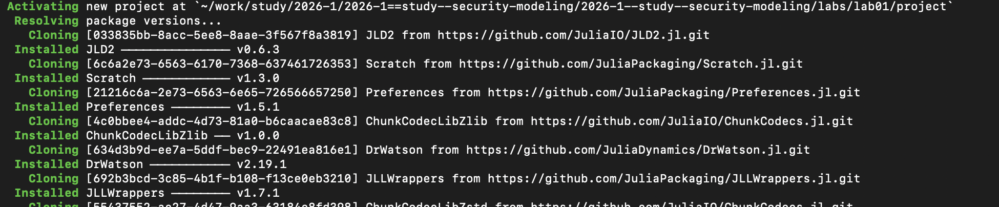
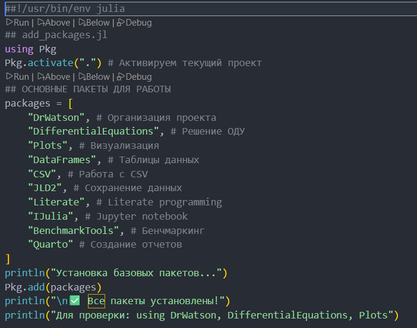
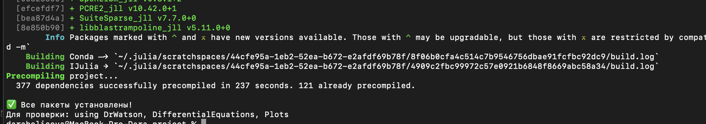
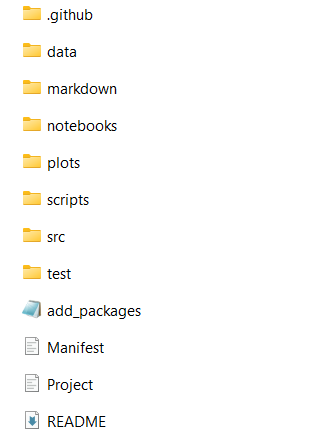
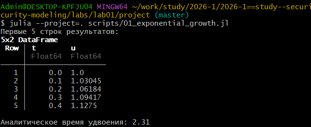
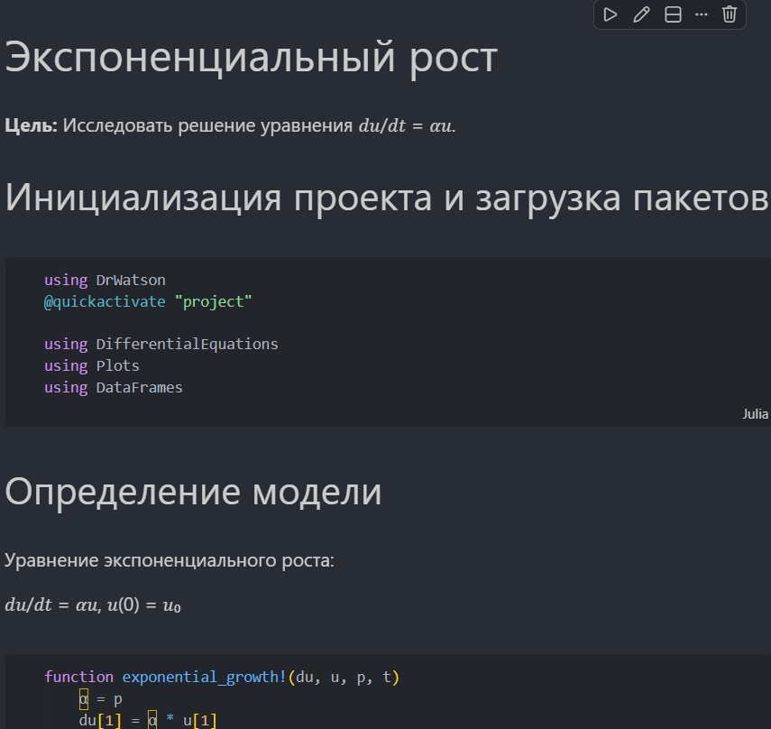
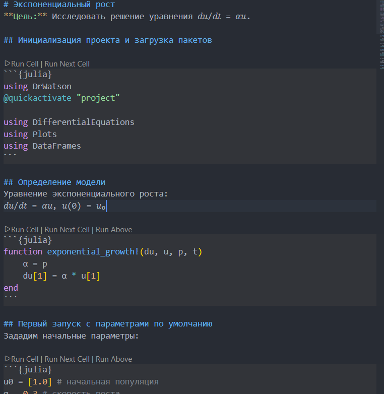
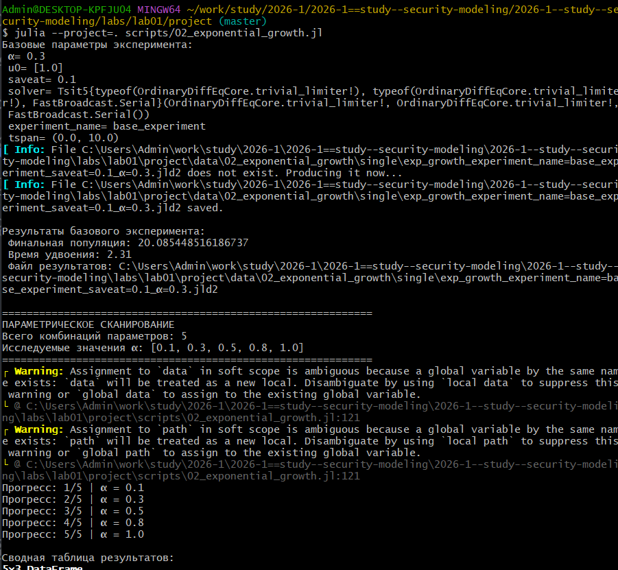
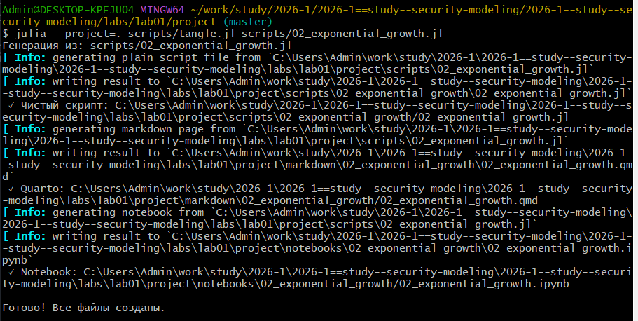

---
author:
  name: Бабенко Артём Сергеевич
  degrees: DSc
  orcid: 0000-0002-0877-7063
  email: 1032259400@rudn.ru
  affiliation:
    - name: Российский университет дружбы народов
      country: Российская Федерация
      postal-code: 117198
      city: Москва
      address: ул. Миклухо-Маклая, д. 6
title: Лабораторная работа №1
subtitle: Литературное программирование
license: CC BY
date: today
date-format: "YYYY-MM-DD"

format:
  beamer:
    lang: ru-RU
    colortheme: default                 
    mainfont: Arial
    monofont: Courier New
    aspectratio: 169
    incremental: false
    toc: false
    footer: false
    slide-number: true
    include-in-header: 
      text: |
        \setbeamertemplate{navigation symbols}{}
        \setbeamertemplate{headline}{}
        \setbeamertemplate{footline}{
          \hfill
          {\small \insertframenumber}
          \hspace{2em}
          \vspace{2em}
        }
        \setbeamertemplate{title page}[empty]
---

## Докладчик

::::: {.columns align="center"}
::: {.column width="70%"}
-   Бабенко Артём Сергеевич
-   студент
-   кафедра теории вероятностей и кибербезопасности
-   Российский университет дружбы народов им. П. Лумумбы
-   <https://github.com/artyombabenko>
:::

::: {.column width="30%"}
{width="70%"}
:::
:::::

## Цель работы

Изучить принципы воспроизводимых научных вычислений с использованием языка программирования Julia и пакетов DrWatson и Literate, а также освоить автоматическую генерацию различных форматов отчётов (скриптов, ноутбуков и документов Quarto) из единого исходного literate-скрипта.

## Задание

-   Изучить структуру научного проекта, организованного с использованием пакета DrWatson.

-   Освоить принципы literate-программирования, объединяющего программный код и документацию.

-   Создать literate-скрипт, содержащий код модели и пояснения.

-   Реализовать скрипт генерации производных форматов с использованием пакета Literate.

## Выполнение лабораторной работы

{#fig-001 width="70%"}

## Выполнение лабораторной работы

{#fig-002 width="40%"}

## Выполнение лабораторной работы

{#fig-003 width="70%"}

## Выполнение лабораторной работы

{#fig-004 width="20%"}

## Выполнение лабораторной работы

{#fig-005 width="70%"}

## Выполнение лабораторной работы

{#fig-009 width="50%"}

## Выполнение лабораторной работы

{#fig-010 width="40%"}

## Выполнение лабораторной работы

{#fig-006 width="40%"}

## Выполнение лабораторной работы

{#fig-007 width="70%"}

## Выводы

В результате работы были освоены принципы literate-программирования и воспроизводимых вычислений, а также реализована автоматическая генерация различных форматов отчётов из единого исходного Julia-скрипта с использованием пакетов DrWatson и Literate.

## Список литературы

1.  DrWatson.jl Documentation. — URL: https://juliadynamics.github.io/DrWatson.jl/stable/ (дата обр. 20.08.2026).

2.  JuliaLang. — URL: https://julialang.org/ (дата обр. 20.08.2026).

3.  Literate.jl Documentation. — URL: https://fredrikekre.github.io/Literate.jl/v2/ (дата обр. 20.08.2026).