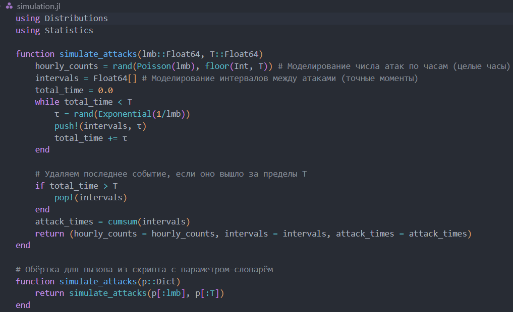
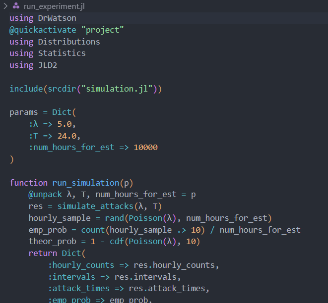
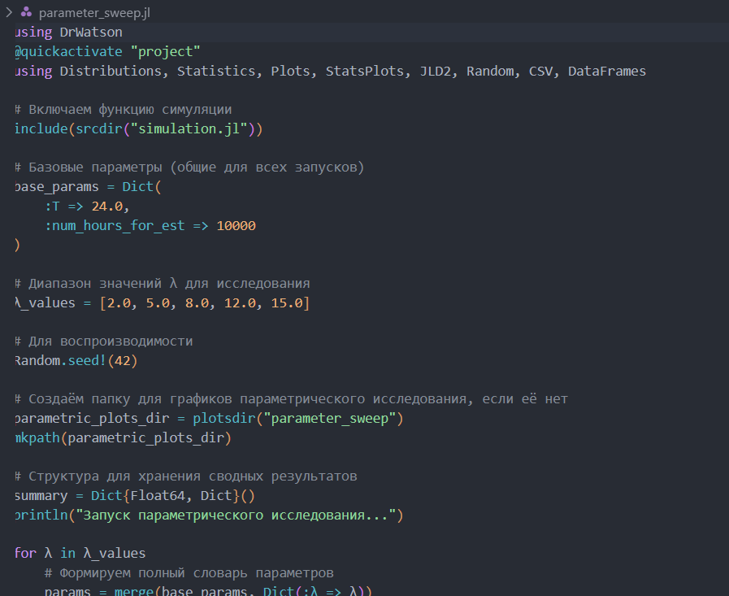
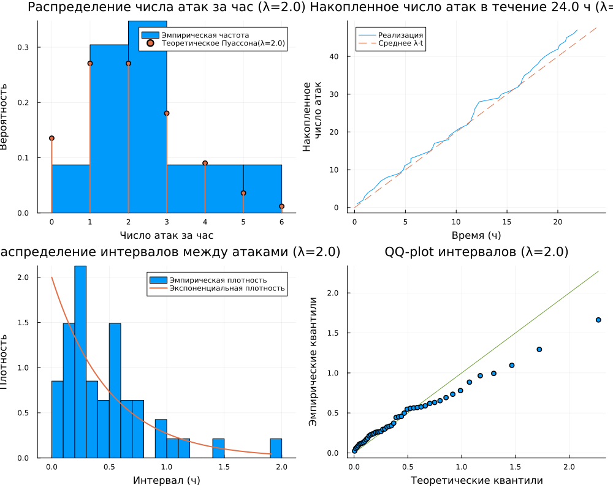
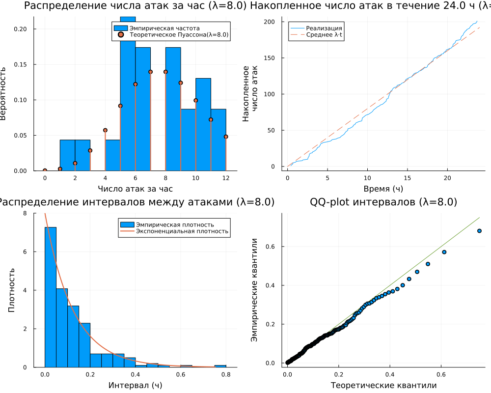

---
author:
  name: Бабенко Артём Сергеевич
  degrees: DSc
  orcid: 0000-0002-0877-7063
  email: 1032259400@rudn.ru
  affiliation:
    - name: Российский университет дружбы народов
      country: Российская Федерация
      postal-code: 117198
      city: Москва
      address: ул. Миклухо-Маклая, д. 6
title: Лабораторная работа №2
subtitle: Основы вероятностного моделирования угроз
license: CC BY
date: today
date-format: "YYYY-MM-DD"

format:
  beamer:
    lang: ru-RU
    colortheme: default                 
    mainfont: Arial
    monofont: Courier New
    aspectratio: 169
    incremental: false
    toc: false
    footer: false
    slide-number: true
    include-in-header: 
      text: |
        \setbeamertemplate{navigation symbols}{}
        \setbeamertemplate{headline}{}
        \setbeamertemplate{footline}{
          \hfill
          {\small \insertframenumber}
          \hspace{2em}
          \vspace{2em}
        }
        \setbeamertemplate{title page}[empty]
---

## Докладчик

:::::::::::::: {.columns align=center}
::: {.column width="70%"}

  * Бабенко Артём Сергеевич
  * студент группы НФИмд-01-25
  * Российский университет дружбы народов
  * [1032259400@rudn.ru](mailto:1032259400@rudn.ru)
  * <https://github.com/artyombabenko>

:::
::: {.column width="30%"}

:::
::::::::::::::

## Цель работы

Освоить базовые методы вероятностного моделирования случайных процессов в контексте кибербезопасности на примере моделирования потока атак на веб-сервер.

## Задачи

- Реализовать симуляцию пуассоновского потока атак.

- Выполнить статистический анализ результатов:
  - гистограмма числа атак за час;
  - накопленное число атак;
  - проверка экспоненциальности интервалов (QQ-plot);
  - оценка вероятности P(>10 атак за час).

- Исследовать сходимость оценки вероятности от объёма выборки.

- Провести параметрическое исследование по λ.

- Преобразовать код в литературный стиль и сгенерировать производные форматы.

## Выполнение работы. Подготовка проекта

{#fig-001 width=65%}

## Выполнение работы. Подготовка проекта

{#fig-002 width=45%}

## Выполнение работы. Подготовка проекта

{#fig-003 width=55%}

## Выполнение работы. Подготовка проекта

{#fig-004 width=50%}

## Выполнение работы. Подготовка проекта

{#fig-005 width=50%}

## Выполнение работы. Генерация производных форматов

{#fig-008 width=45%}

## Выполнение работы. Генерация производных форматов

{#fig-006 width=50%}

## Выполнение работы. Генерация производных форматов

{#fig-007 width=55%}

## Детальные графики

{#fig-009 width=50%}

## Детальные графики

{#fig-010 width=50%}

## Детальные графики

{#fig-011 width=50%}

## Детальные графики

{#fig-012 width=50%}

## Детальные графики

{#fig-013 width=50%}

## Выводы

1. Сформирована структура рабочего пространства на основе DrWatson с разделением исходных кодов, данных и документации.

2. Реализована симуляция пуассоновского потока атак двумя способами: почасовые счётчики и точные моменты через экспоненциальные интервалы.

3. Выполнен статистический анализ: гистограммы, накопленный график, QQ-plot подтверждают соответствие теоретическим распределениям.

4. Проведено параметрическое исследование: при росте λ от 2 до 15 вероятность P(>10) возрастает от ~0 до ~0.88.

5. Исследована сходимость оценки вероятности редкого события: для надёжной оценки при λ=5 необходим объём выборки порядка 10 000–100 000 часов.

6. Из литературного кода автоматически сгенерированы три формата: чистый скрипт, Jupyter Notebook и документ Quarto.

## Список литературы

1. JuliaLang [Электронный ресурс]. 2024 JuliaLang.org contributors. URL: https://julialang.org/ (дата обращения: 11.10.2024).

2. Literate.jl Documentation [Электронный ресурс]. Fredrik Ekre. URL: https://fredrikekre.github.io/Literate.jl/v2/ (дата обращения: 11.10.2024).

3. DrWatson.jl Documentation [Электронный ресурс]. JuliaDynamics. URL: https://juliadynamics.github.io/DrWatson.jl/stable/ (дата обращения: 11.10.2024).