---
author:
  name: Бабенко Артём Сергеевич
  degrees: DSc
  orcid: 0000-0002-0877-7063
  email: 1032259400@rudn.ru
  affiliation:
    - name: Российский университет дружбы народов
      country: Российская Федерация
      postal-code: 117198
      city: Москва
      address: ул. Миклухо-Маклая, д. 6

title: "Лабораторная работа №3"
subtitle: "Моделирование графов атак"
license: "CC BY"
---

# Цель работы

— Освоить методы построения и анализа графов атак для оценки уязвимостей сетевой инфраструктуры.  
— На примере моделирования атак на корпоративную сеть изучить:  
  — представление сетевой топологии и уязвимостей в виде ориентированного графа;  
  — алгоритмы поиска всех возможных путей атаки от начальных точек до целевых активов;  
  — расчёт метрик центральности для определения критических узлов;  
  — визуализацию графа с цветовой индикацией уровня риска;  
  — оценку вероятности успешной атаки с учётом сложности эксплуатации уязвимостей.

# Задание

- Построить граф атак для заданной топологии сети.
- Реализовать алгоритм поиска всех путей от заданного источника к цели.
- Рассчитать метрики центральности для всех узлов и выявить наиболее критичные.
- Визуализировать граф, раскрашивая узлы в зависимости от степени риска.
- Присвоить каждому ребру вес (вероятность успешной атаки) и вычислить наиболее вероятный путь атаки.

# Теоретическое введение

Граф атак (Attack Graph) — это ориентированный граф, в котором вершины представляют состояния системы (узлы сети, привилегии, факты), а рёбра — действия, которые может выполнить атакующий для перехода из одного состояния в другое. В упрощённой модели граф атак можно представить как ориентированный граф, где:

- вершины — сетевые узлы (хост, сервер, рабочая станция);
- направленные рёбра — возможность атаки с одного узла на другой (через эксплойт уязвимости, доверительные отношения, сетевой доступ).

Для каждого узла можно задать уровень защищённости, список уязвимостей и тип узла.

Задача анализа графа атак сводится к нахождению всех путей от источника (злоумышленник) к цели (критический актив). Для этого применяются алгоритмы поиска в глубину (DFS), в ширину (BFS) и алгоритм Дейкстры для поиска наименее сложного пути.

Для выявления критичных узлов используются метрики центральности: степень центральности (in-degree, out-degree), центральность по посредничеству, по близости и PageRank.

Если каждому ребру присвоить вероятность успешной эксплуатации, то вероятность успешной атаки по пути вычисляется как произведение вероятностей рёбер.

# Выполнение лабораторной работы

## Подготовка каталога

Создадим рабочий каталог для кода.

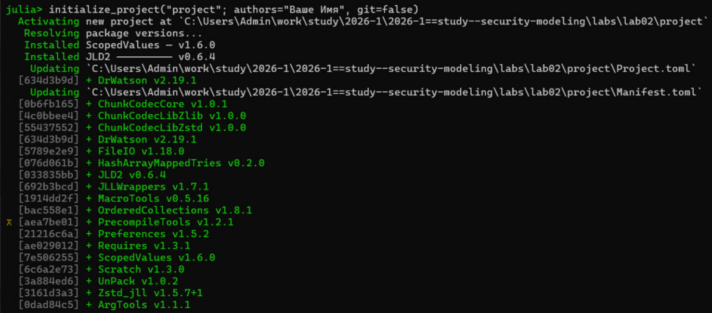{#fig-001 width="70%"}

Содержимое каталога.

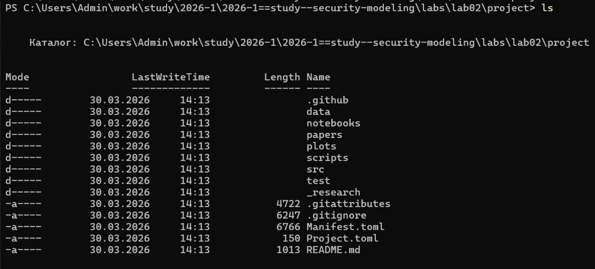{#fig-002 width="70%"}

Установим необходимые пакеты.

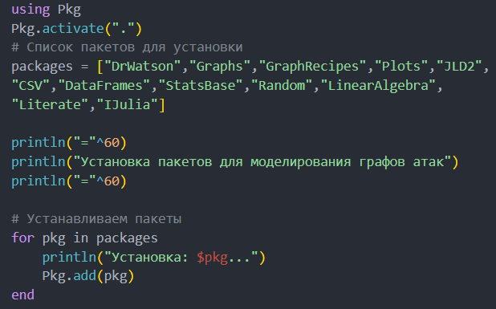{#fig-003 width="70%"}

## Ядро моделирования графа атак

Создадим ядро моделирования графа атак, которое содержит все функции для построения ориентированного графа атак, поиска путей, расчёта метрик центральности, присвоения весов и нахождения наиболее вероятного пути.

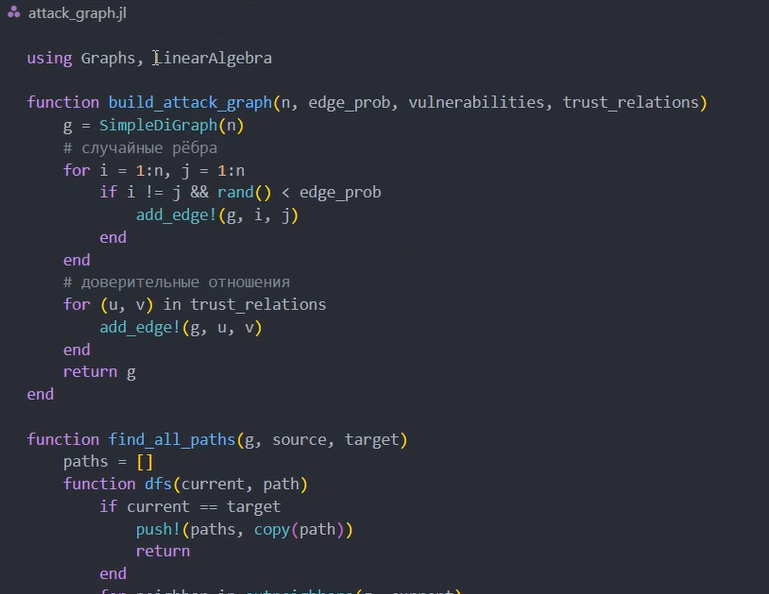{#fig-004 width="70%"}

## Однократный запуск эксперимента

Напишем скрипт `scripts/ag_run_experiment.jl`, который выполняет построение графа атак для заданных параметров, находит все пути, вычисляет метрики центральности, определяет наиболее вероятный путь и сохраняет результаты.

{#fig-005 width="70%"}

{#fig-006 width="70%"}

## Визуализация и анализ графа

Напишем скрипт `scripts/ag_analyze.jl`, который загружает сохранённые данные, строит изображение графа с цветовой индикацией по PageRank и выводит статистику.

{#fig-007 width="70%"}

{#fig-008 width="70%"}

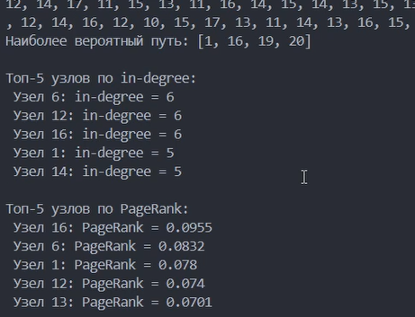{#fig-009 width="70%"}

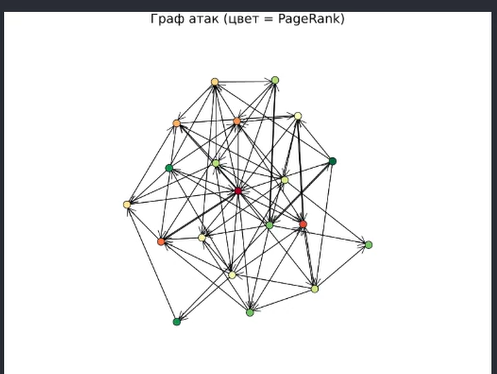{#fig-010 width="70%"}

## Исследование масштабируемости

Напишем скрипт `scripts/ag_convergence.jl`, который исследует, как размер сети влияет на время поиска всех путей и количество найденных путей.

{#fig-011 width="70%"}

{#fig-012 width="70%"}

{#fig-013 width="70%"}

## Параметрическое исследование

Напишем скрипт `scripts/parameter_sweep.jl`, который изучает, как изменение плотности рёбер влияет на количество путей атаки, максимальную входящую степень и среднюю длину пути.

{#fig-014 width="70%"}

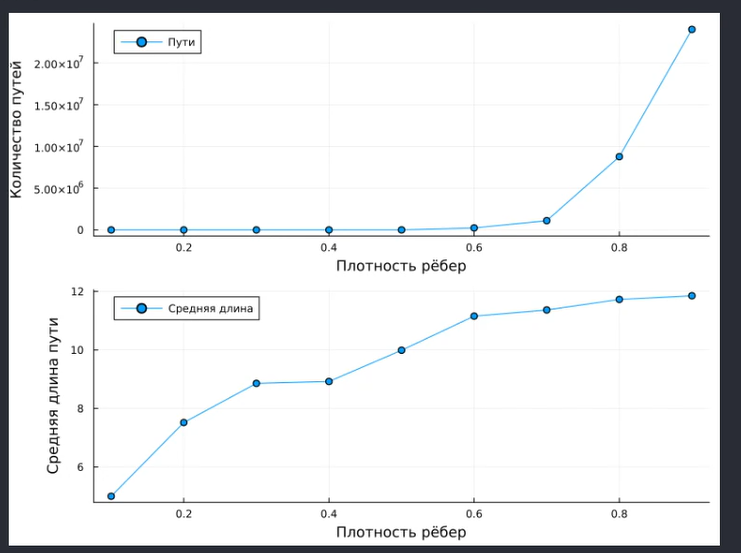{#fig-015 width="70%"}

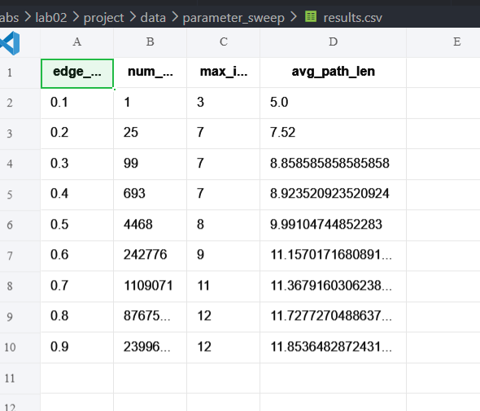{#fig-016 width="70%"}

## Преобразование кода в литературный стиль

Преобразуем код в литературный стиль.

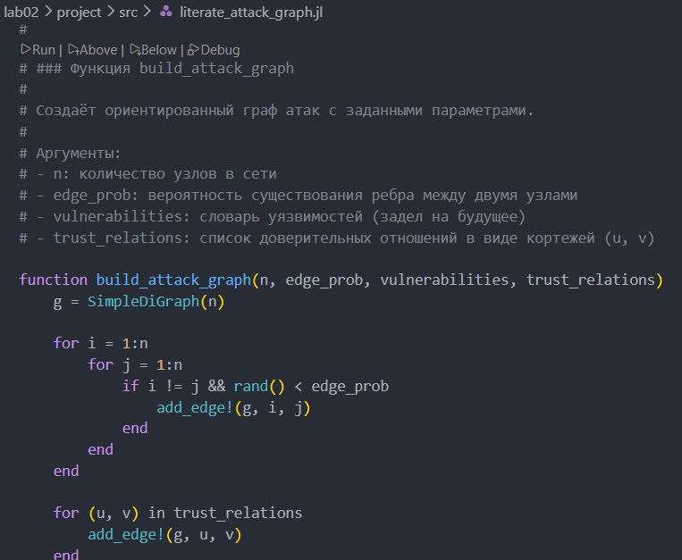{#fig-017 width="70%"}

Сгенерируем из литературного кода чистый код, Jupyter Notebook и документацию в формате Quarto.

{#fig-018 width="70%"}

Выполним код из Jupyter Notebook.

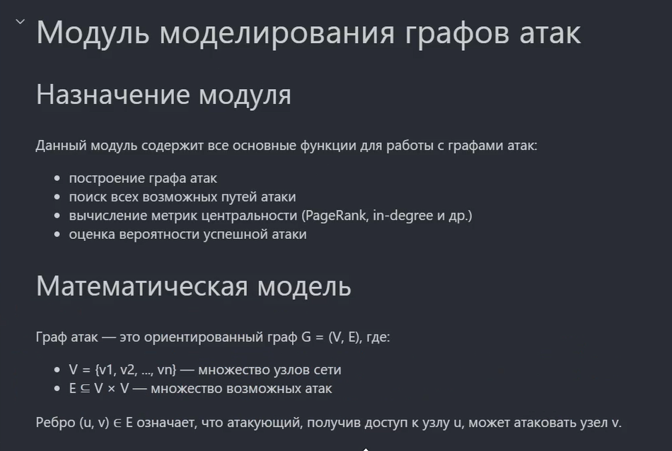{#fig-019 width="70%"}

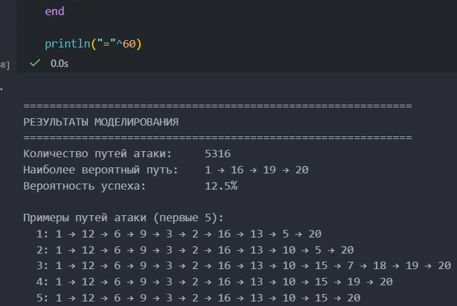{#fig-020 width="70%"}

Интегрируем документацию в формате Quarto в отчёт.

{#fig-021 width="70%"}

## Изменение кода

Добавим в код в литературном стиле вычисление для набора параметров.

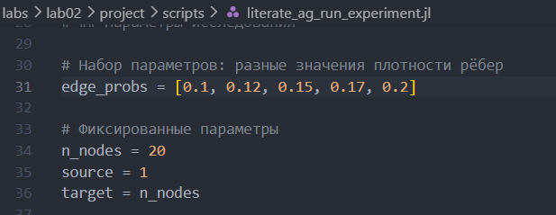{#fig-022 width="70%"}

Сгенерируем из литературного кода с параметрами чистый код, Jupyter Notebook и документацию в формате Quarto.

Выполним код из Jupyter Notebook.

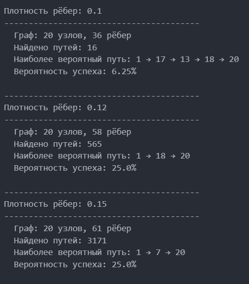{#fig-023 width="70%"}

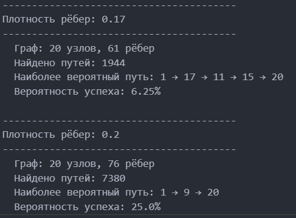{#fig-024 width="70%"}

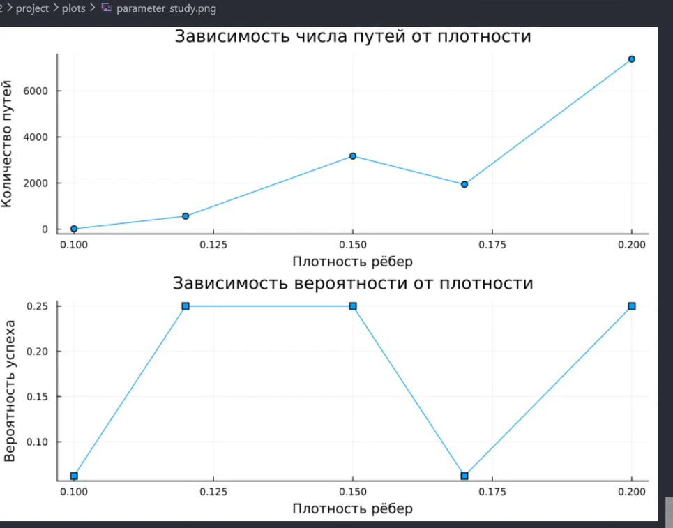{#fig-025 width="70%"}

Интегрируем документацию с параметрами в формате Quarto в отчёт.

## Реализация модуля AttackGraph



## Запуск эксперимента



## Анализ и визуализация



## Исследование масштабируемости



## Параметрическое исследование



# Контрольные вопросы

**1. Что такое граф атак и для чего он используется?**

Граф атак — это ориентированный граф, вершины которого представляют узлы сети или состояния системы, а рёбра — возможные действия атакующего. Используется для анализа уязвимостей, поиска путей атаки, оценки рисков и выявления критичных узлов.

**2. Какие алгоритмы поиска путей применяются в анализе графов атак?**

- DFS — для нахождения всех путей.
- BFS — для кратчайшего пути.
- Алгоритм Дейкстры — для поиска наиболее вероятного пути с учётом весов рёбер.

**3. Что означают метрики центральности (in-degree, PageRank) в контексте безопасности?**

- **In-degree** — количество атак, ведущих к узлу. Высокое значение означает, что узел часто атакуют.
- **PageRank** — важность узла, учитывающая важность ссылающихся на него узлов. Высокий PageRank означает критическое звено.

**4. Как можно оценить вероятность успешной атаки с помощью весов рёбер?**

Вероятность успеха по пути вычисляется как произведение вероятностей успеха на каждом ребре. Для поиска наиболее вероятного пути используется алгоритм Дейкстры с весом, равным отрицательному логарифму вероятности.

**5. Какие ограничения имеет модель графа атак в реальных условиях?**

- Статичность (не учитывает изменения сети).
- Не учитывает защитные механизмы (МЭ, IDS).
- Игнорирует временные факторы и человеческий фактор.
- Экспоненциальный рост числа путей для больших сетей.

**6. Как можно расширить модель для учёта защитных механизмов (например, межсетевые экраны)?**

- Добавить блокирующие правила (удалить рёбра).
- Ввести вероятности обнаружения.
- Добавить узлы-защитники (фаерволы, IDS).
- Использовать взвешенные рёбра с учётом защиты.

# Выводы

В ходе выполнения лабораторной работы освоены методы построения и анализа графов атак для оценки уязвимостей сетевой инфраструктуры. На примере моделирования атак на корпоративную сеть изучены представление сетевой топологии в виде ориентированного графа, алгоритмы поиска путей атаки, расчёт метрик центральности для определения критических узлов, визуализация графа с цветовой индикацией уровня риска и оценка вероятности успешной атаки с учётом сложности эксплуатации уязвимостей.

# Список литературы {.unnumbered}

::: {#refs}
:::