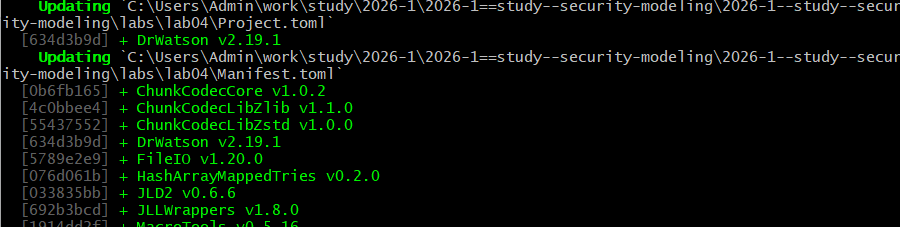
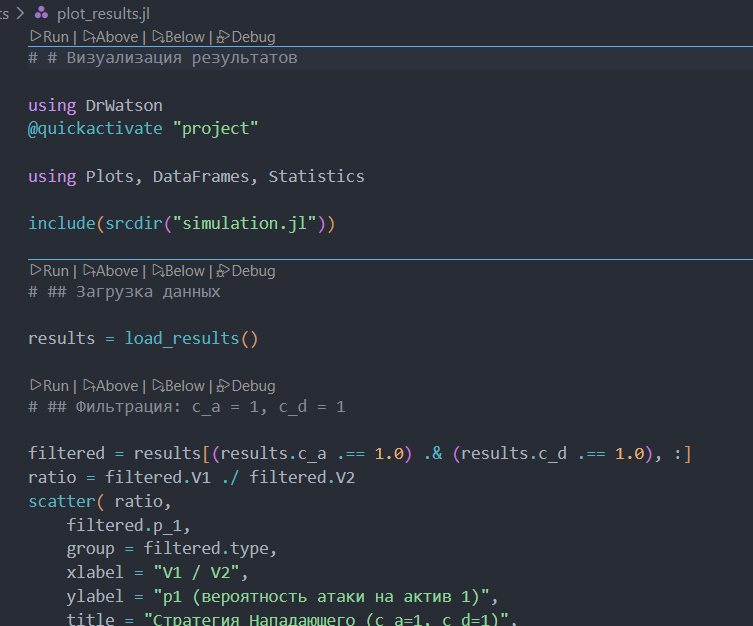
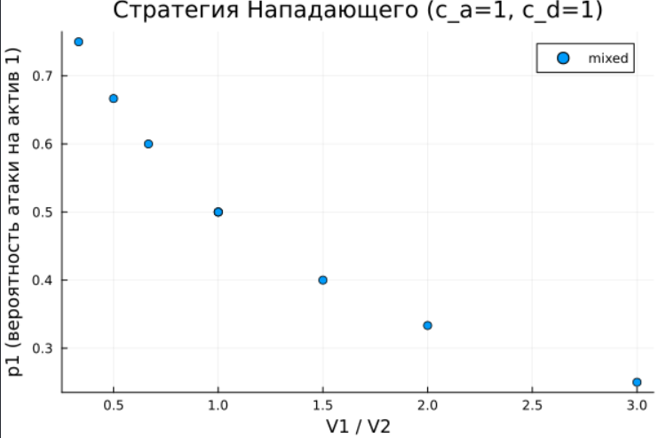
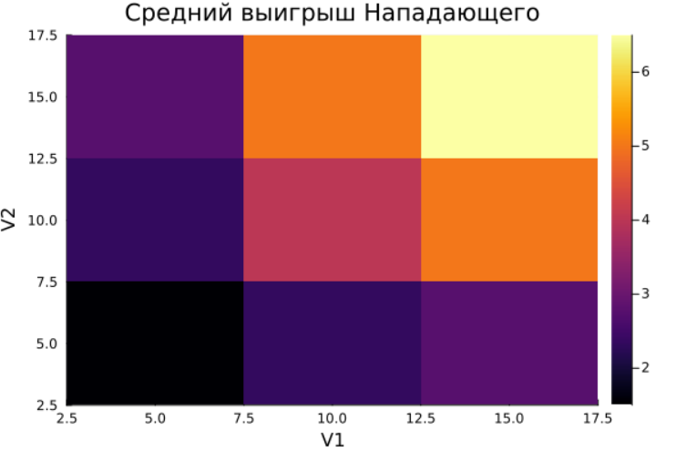
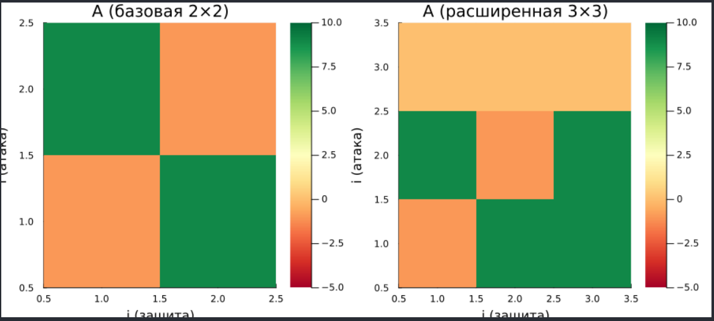

---
author:
  name: Бабенко Артём Сергеевич
  degrees: MSc
  email: 1032259400@rudn.ru
  affiliation:
    - name: Российский университет дружбы народов
      country: Российская Федерация
      postal-code: 117198
      city: Москва
      address: ул. Миклухо-Маклая, д. 6

title: "Лабораторная работа №4"
subtitle: "Моделирование конфликта Защитник–Нападающий"
license: "CC BY"
date: today
date-format: "YYYY-MM-DD"

format:
  beamer:
    lang: ru-RU
    colortheme: default                 
    mainfont: Arial
    monofont: Courier New
    aspectratio: 169
    incremental: false
    toc: false
    footer: false
    slide-number: true
    include-in-header: 
      text: |
        \setbeamertemplate{navigation symbols}{}
        \setbeamertemplate{headline}{}
        \setbeamertemplate{footline}{
          \hfill
          {\small \insertframenumber}
          \hspace{2em}
          \vspace{2em}
        }
        \setbeamertemplate{title page}[empty]
---

## Докладчик

:::::::::::::: {.columns align=center}
::: {.column width="70%"}

  * Бабенко Артём Сергеевич
  * студент группы НФИмд-01-25
  * Российский университет дружбы народов
  * [1032259400@rudn.ru](mailto:1032259400@rudn.ru)
  * <https://github.com/artyombabenko>

:::
::: {.column width="30%"}

:::
::::::::::::::

## Цель работы

Освоить применение теории игр для анализа противостояния в сфере информационной безопасности. Научиться строить матричную игру, находить равновесие Нэша в чистых и смешанных стратегиях.

## Задание

- Формализовать конфликт «Защитник–Нападающий» в виде антагонистической игры.
- Реализовать на Julia функции расчёта платёжной матрицы, поиска равновесия Нэша и симуляции игры.
- Визуализировать зависимость ожидаемого выигрыша и равновесных вероятностей от стоимости защиты и величины ущерба.

# Выполнение лабораторной работы

## Создание проекта

{#fig-001 width=70%}

## Создание проекта

{#fig-002 width=70%}

## Основной модуль

{#fig-003 width=50%}

## Запуск симуляций

{#fig-004 width=60%}

## Построение графиков

{#fig-005 width=50%}

## Результаты визуализации

{#fig-006 width=60%}

## Результаты визуализации

{#fig-007 width=70%}

## Дополнительное задание

{#fig-008 width=50%}

## Дополнительное задание

{#fig-009 width=70%}

## Генерация производных форматов

{#fig-010 width=70%}

## Генерация производных форматов

{#fig-011 width=70%}

## Выводы

На Julia созданы функции расчёта платёжной матрицы, поиска равновесия Нэша и симуляции игры для формализации конфликта «Защитник–Нападающий» в виде антагонистической игры. Визуализированы зависимость ожидаемого выигрыша и равновесных вероятностей от стоимости защиты и величины ущерба.

## Список литературы

1. JuliaLang [Электронный ресурс]. 2024 JuliaLang.org contributors. URL: https://julialang.org/ (дата обращения: 29.08.2026).

2. DrWatson.jl Documentation [Электронный ресурс]. JuliaDynamics. URL: https://juliadynamics.github.io/DrWatson.jl/stable/ (дата обращения: 29.08.2026).

3. Literate.jl Documentation [Электронный ресурс]. Fredrik Ekre. URL: https://fredrikekre.github.io/Literate.jl/v2/ (дата обращения: 29.08.2026).