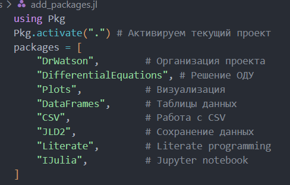
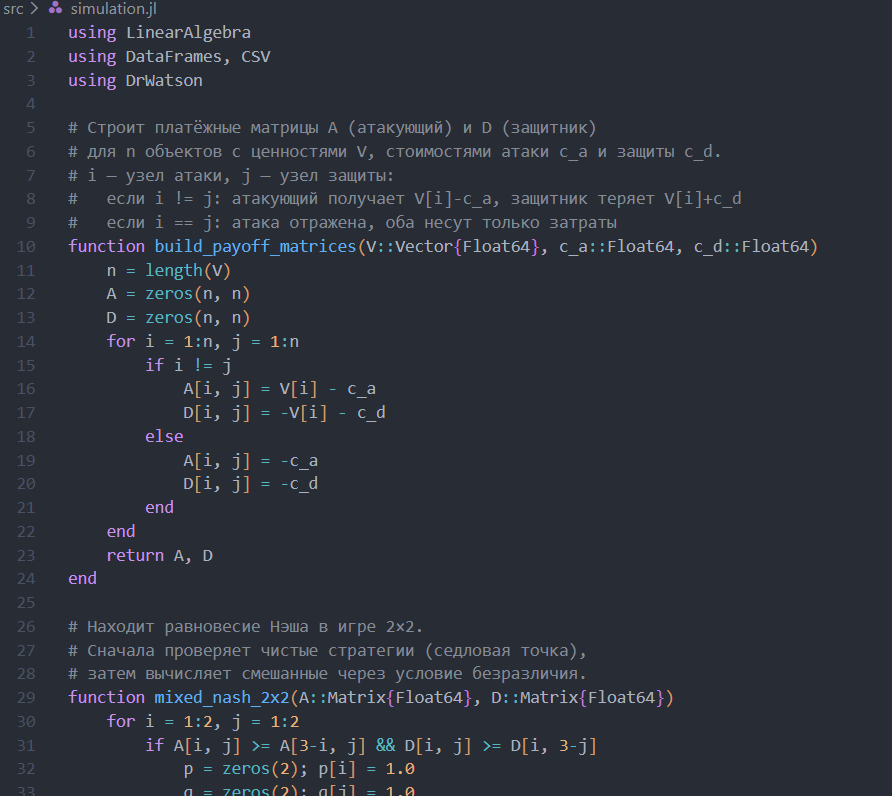
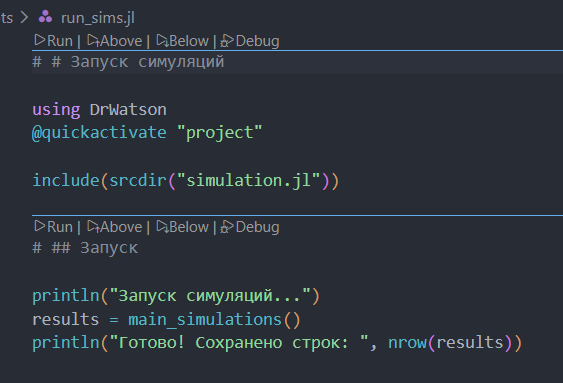
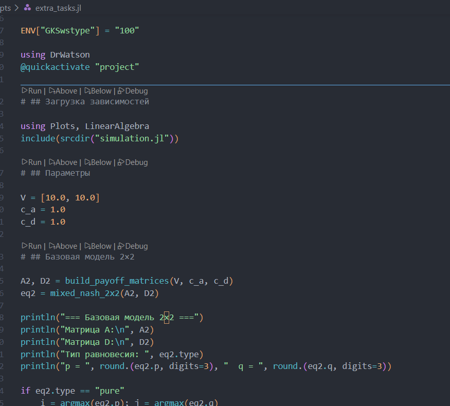
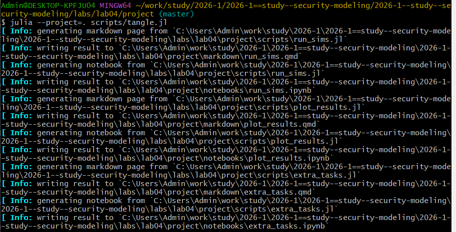
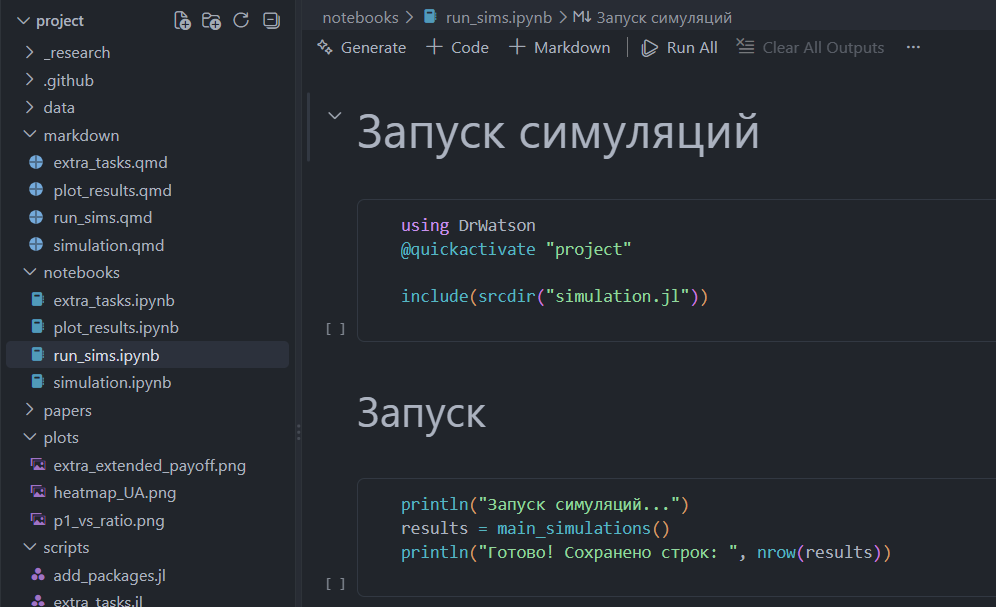

---
author:
  name: Бабенко Артём Сергеевич
  degrees: MSc
  email: 1032259400@rudn.ru
  affiliation:
    - name: Российский университет дружбы народов
      country: Российская Федерация
      postal-code: 117198
      city: Москва
      address: ул. Миклухо-Маклая, д. 6

title: "Лабораторная работа №4"
subtitle: "Моделирование конфликта Защитник–Нападающий"
license: "CC BY"
---

# Цель работы

Освоить применение теории игр для анализа противостояния в сфере информационной безопасности. Научиться строить матричную игру, находить равновесие Нэша в чистых и смешанных стратегиях.

# Задание

- Формализовать конфликт «Защитник–Нападающий» в виде антагонистической игры.
- Реализовать на Julia функции расчёта платёжной матрицы, поиска равновесия Нэша и симуляции игры.
- Визуализировать зависимость ожидаемого выигрыша и равновесных вероятностей от стоимости защиты и величины ущерба.

# Теоретическое введение

Теория игр — раздел математики, изучающий модели принятия решений в условиях конфликта. В информационной безопасности она применяется для анализа стратегического взаимодействия Защитника (Defender) и Нападающего (Attacker).

Основные элементы модели:
- **Игроки**: Защитник и Нападающий.
- **Стратегии**: доступные каждому игроку действия (защитить или атаковать конкретный узел сети).
- **Функции выигрыша**: количественная оценка результата для каждого игрока в зависимости от выбранных стратегий.

Антагонистическая игра — игра с прямо противоположными интересами игроков: выигрыш одного равен проигрышу другого. Модель «Защитник–Нападающий» является игрой с нулевой суммой, так как сумма выигрышей постоянна:
- При успешной атаке: $(V_i - c_a) + (-V_i - c_d) = -c_a - c_d$
- При отражённой атаке: $(-c_a) + (-c_d) = -c_a - c_d$

Выигрыш Нападающего — это ущерб Защитника, что отражает антагонизм их интересов.

Для анализа стратегического взаимодействия применяется теория игр [@julialang]. Реализация модели выполнена на языке Julia с использованием пакетов DrWatson [@drwatsonjl] и Literate [@literatejl].

# Выполнение лабораторной работы

## Создание проекта

Создадим проект с помощью DrWatson и установим необходимые пакеты для дальнейшей работы с помощью скрипта `add_packages.jl` ([рис. @fig-001], [рис. @fig-002]).

{#fig-001 width="70%"}

{#fig-002 width="70%"}

## Основной модуль

Файл `src/simulation.jl` является основным модулем, используемым для моделирования ([рис. @fig-003]). Он содержит несколько функций:

- `build_payoff_matrices(V::Vector{Float64}, c_a::Float64, c_d::Float64)` — строит две платёжные матрицы игры размера n × n.
- `mixed_nash_2x2(A::Matrix{Float64}, D::Matrix{Float64})` — ищет равновесие Нэша для биматричной игры 2×2.
- `run_simulation(params::Dict)` — проводит один эксперимент с заданными параметрами игры.
- `generate_params()` — формирует полную сетку параметров для симуляционного эксперимента.
- `main_simulations()` — основная функция запуска всех симуляций.
- `load_results()` — загружает ранее сохранённые результаты из CSV-файла.

{#fig-003 width="70%"}

## Запуск симуляций

Скрипт `scripts/run_sims.jl` печатает сообщение о запуске, выполняет `main_simulations()` (все комбинации параметров) и выводит количество рассчитанных вариантов ([рис. @fig-004]).

{#fig-004 width="70%"}

## Построение графиков

Файл `scripts/plot_results.jl` выполняет следующие действия ([рис. @fig-005]):

- Загружает результаты через `load_results()`.
- Фильтрует строки с `c_a = 1.0` и `c_d = 1.0`.
- Строит точечный график зависимости вероятности атаки на первый актив `p1` от отношения ценностей `V1/V2` ([рис. @fig-006]). Точки разделены по типу равновесия (pure/mixed). Сохраняет в `plots/p1_vs_ratio.png`.
- Группирует отфильтрованные данные по `V1` и `V2`, вычисляет средний ожидаемый выигрыш Нападающего `UA_mean`.
- Строит тепловую карту среднего выигрыша Нападающего в координатах `(V1, V2)` ([рис. @fig-007]). Сохраняет в `plots/heatmap_UA.png`.

{#fig-005 width="70%"}

Запускаем этот скрипт и в результате выполнения `scripts/plot_results.jl` получаем следующие графики ([рис. @fig-006], [рис. @fig-007]):

{#fig-006 width="70%"}

{#fig-007 width="70%"}

## Дополнительное задание

В рамках дополнительного задания рассмотрим расширенную модель 3×3, добавляющую стратегии «не атаковать» для Нападающего и «не защищать ничего» для Защитника ([рис. @fig-008]).

{#fig-008 width="70%"}

В результате выполнения скрипта `extra_tasks.jl` получаем сравнение платёжных матриц базовой и расширенной моделей ([рис. @fig-009]).

{#fig-009 width="70%"}

## Генерация производных форматов

Генерируем производные форматы с помощью скрипта `tangle.jl` ([рис. @fig-010]).

{#fig-010 width="70%"}

Получаем файлы других форматов: Jupyter Notebook, `.qmd` — Quarto Markdown ([рис. @fig-011]).

{#fig-011 width="70%"}

## Реализация модуля simulation.jl

```julia
using LinearAlgebra
using DataFrames, CSV
using DrWatson
```

Строит платёжные матрицы A (атакующий) и D (защитник)
для n объектов с ценностями V, стоимостями атаки c_a и защиты c_d.
i — узел атаки, j — узел защиты:
  если i != j: атакующий получает V[i]-c_a, защитник теряет V[i]+c_d
  если i == j: атака отражена, оба несут только затраты

```julia
function build_payoff_matrices(V::Vector{Float64}, c_a::Float64, c_d::Float64)
    n = length(V)
    A = zeros(n, n)
    D = zeros(n, n)
    for i = 1:n, j = 1:n
        if i != j
            A[i, j] = V[i] - c_a
            D[i, j] = -V[i] - c_d
        else
            A[i, j] = -c_a
            D[i, j] = -c_d
        end
    end
    return A, D
end
```

Находит равновесие Нэша в игре 2×2.
Сначала проверяет чистые стратегии (седловая точка),
затем вычисляет смешанные через условие безразличия.

```julia
function mixed_nash_2x2(A::Matrix{Float64}, D::Matrix{Float64})
    for i = 1:2, j = 1:2
        if A[i, j] >= A[3-i, j] && D[i, j] >= D[i, 3-j]
            p = zeros(2); p[i] = 1.0
            q = zeros(2); q[j] = 1.0
            return (p = p, q = q, type = "pure")
        end
    end
    denomA = (A[1,1] - A[2,1]) - (A[1,2] - A[2,2])
    q1 = abs(denomA) > 1e-10 ? clamp((A[2,2] - A[1,2]) / denomA, 0.0, 1.0) : 0.5
    q = [q1, 1 - q1]
    denomD = (D[1,1] - D[1,2]) - (D[2,1] - D[2,2])
    p1 = abs(denomD) > 1e-10 ? clamp((D[2,2] - D[2,1]) / denomD, 0.0, 1.0) : 0.5
    p = [p1, 1 - p1]
    return (p = p, q = q, type = "mixed")
end
```

Запускает один эксперимент для заданного набора параметров,
возвращает словарь с результатами (стратегии, тип равновесия, выигрыши).

```julia
function run_simulation(params::Dict)
    V = params["V"]; c_a = params["c_a"]; c_d = params["c_d"]
    A, D = build_payoff_matrices(V, c_a, c_d)
    eq = mixed_nash_2x2(A, D)
    if eq.type == "pure"
        i = argmax(eq.p); j = argmax(eq.q)
        UA = A[i, j]; UD = D[i, j]
    else
        UA = eq.p' * A * eq.q; UD = eq.p' * D * eq.q
    end
    return Dict("p_1"=>eq.p[1], "p_2"=>eq.p[2], "q_1"=>eq.q[1], "q_2"=>eq.q[2],
                "type"=>eq.type, "UA"=>UA, "UD"=>UD, "V1"=>V[1], "V2"=>V[2],
                "c_a"=>c_a, "c_d"=>c_d)
end
```

Генерирует сетку параметров: 3 значения V1, 3 значения V2,
3 значения c_a, 3 значения c_d → 81 комбинация.

```julia
function generate_params()
    dicts = []
    for v1 in [5.0, 10.0, 15.0], v2 in [5.0, 10.0, 15.0]
        for c_a in [0.0, 1.0, 3.0], c_d in [0.0, 1.0, 3.0]
            push!(dicts, Dict("V" => [v1, v2], "c_a" => c_a, "c_d" => c_d))
        end
    end
    return dicts
end
```

Прогоняет все комбинации параметров, собирает результаты в DataFrame
и сохраняет в data/sims/results.csv.

```julia
function main_simulations()
    params_list = generate_params()
    rows = [run_simulation(p) for p in params_list]
    results = DataFrame(rows)
    mkpath(datadir("sims"))
    CSV.write(datadir("sims", "results.csv"), results)
    return results
end
```

Загружает сохранённые результаты из CSV.

```julia
function load_results()
    path = datadir("sims", "results.csv")
    isfile(path) ? CSV.read(path, DataFrame) : error("File not found. Run main_simulations() first.")
end
```

Расширенная матрица 3×3: добавляет стратегии «не атаковать» и «не защищать».

```julia
function build_payoff_matrices_3x3(V::Vector{Float64}, c_a::Float64, c_d::Float64)
    A = zeros(3, 3)
    D = zeros(3, 3)
    for i = 1:2, j = 1:2
        if i != j
            A[i, j] = V[i] - c_a
            D[i, j] = -V[i] - c_d
        else
            A[i, j] = -c_a
            D[i, j] = -c_d
        end
    end
    for j = 1:3
        A[3, j] = 0.0
        D[3, j] = j <= 2 ? -c_d : 0.0
    end
    for i = 1:2
        A[i, 3] = V[i] - c_a
        D[i, 3] = -V[i]
    end
    return A, D
end
```

## Запуск симуляций

```julia
using DrWatson
@quickactivate "project"

include(srcdir("simulation.jl"))
```

```julia
println("Запуск симуляций...")
results = main_simulations()
println("Готово! Сохранено строк: ", nrow(results))
```

## Визуализация результатов

```julia
using DrWatson
@quickactivate "project"

using Plots, DataFrames, Statistics

include(srcdir("simulation.jl"))
```

```julia
results = load_results()
```

```julia
filtered = results[(results.c_a .== 1.0) .& (results.c_d .== 1.0), :]
ratio = filtered.V1 ./ filtered.V2
scatter( ratio,
    filtered.p_1,
    group = filtered.type,
    xlabel = "V1 / V2",
    ylabel = "p1 (вероятность атаки на актив 1)",
    title = "Стратегия Нападающего (c_a=1, c_d=1)",
    legend = :topright,
)
savefig(plotsdir("p1_vs_ratio.png"))
```

Тепловая карта выигрыша Нападающего

```julia
grp = groupby(filtered, [:V1, :V2])
summ = combine(grp, :UA => mean => :UA_mean)
heatmap(
    sort(unique(summ.V1)),
    sort(unique(summ.V2)),
    (x, y) -> summ[(summ.V1 .== x) .& (summ.V2 .== y), :UA_mean][1],
    xlabel = "V1",
    ylabel = "V2",
    title = "Средний выигрыш Нападающего",
)
savefig(plotsdir("heatmap_UA.png"))
```

## Дополнительное задание

Добавляем стратегию «Не атаковать» для Нападающего и «Не защищать ничего»
для Защитника. Платёжная матрица становится 3×3. Модифицируем функции,
находим равновесие и сравниваем с базовой моделью 2×2.

```julia
ENV["GKSwstype"] = "100"

using DrWatson
@quickactivate "project"
```

```julia
using Plots, LinearAlgebra
include(srcdir("simulation.jl"))
```

```julia
V = [10.0, 10.0]
c_a = 1.0
c_d = 1.0
```

```julia
A2, D2 = build_payoff_matrices(V, c_a, c_d)
eq2 = mixed_nash_2x2(A2, D2)

println("=== Базовая модель 2×2 ===")
println("Матрица A:\n", A2)
println("Матрица D:\n", D2)
println("Тип равновесия: ", eq2.type)
println("p = ", round.(eq2.p, digits=3), "  q = ", round.(eq2.q, digits=3))

if eq2.type == "pure"
    i = argmax(eq2.p); j = argmax(eq2.q)
    UA2 = A2[i, j]; UD2 = D2[i, j]
else
    UA2 = eq2.p' * A2 * eq2.q
    UD2 = eq2.p' * D2 * eq2.q
end
println("UA = ", round(UA2, digits=3), "  UD = ", round(UD2, digits=3))
```

```julia
A3, D3 = build_payoff_matrices_3x3(V, c_a, c_d)

println("\n=== Расширенная модель 3×3 ===")
println("Матрица A:\n", A3)
println("Матрица D:\n", D3)
```

```julia
p1 = heatmap(A2,
    title = "A (базовая 2×2)",
    xlabel = "j (защита)", ylabel = "i (атака)",
    color = :RdYlGn, clims = (-5, 10), size = (400, 350))

p2 = heatmap(A3,
    title = "A (расширенная 3×3)",
    xlabel = "j (защита)", ylabel = "i (атака)",
    color = :RdYlGn, clims = (-5, 10), size = (400, 350))

plot(p1, p2, layout = (1, 2), size = (900, 400))
savefig(plotsdir("extra_extended_payoff.png"))
println("График сохранён: extra_extended_payoff.png")
```

# Контрольные вопросы

**1. Что такое антагонистическая игра? Почему модель «Защитник–Нападающий» можно считать игрой с нулевой суммой?**

Антагонистическая игра — игра с прямо противоположными интересами игроков: выигрыш одного равен проигрышу другого.

Модель является игрой с нулевой суммой, так как сумма выигрышей постоянна:
- При успешной атаке: $(V_i - c_a) + (-V_i - c_d) = -c_a - c_d$
- При отражённой атаке: $(-c_a) + (-c_d) = -c_a - c_d$

Выигрыш Нападающего — это ущерб Защитника, что отражает антагонизм их интересов.

**2. Дайте определение равновесия Нэша в чистых и смешанных стратегиях. Приведите пример, когда равновесия в чистых стратегиях не существует.**

Равновесие Нэша — набор стратегий, при котором ни одному игроку не выгодно отклоняться в одностороннем порядке.

- В чистых стратегиях: каждый игрок выбирает одно действие с вероятностью 1.
- В смешанных стратегиях: игроки рандомизируют действия, выбирая вероятностное распределение.

Пример отсутствия чистого равновесия — игра «Орлянка». Ни одна из четырёх клеток не является равновесием, но существует смешанное равновесие (0.5, 0.5).

**3. Как изменится равновесная стратегия защитника, если ущерб от успешной атаки на незащищённый сервер станет бесконечно большим?**

При `V1 → ∞`:
- Вероятность защиты первого актива `q1* → 1`
- Защитник всегда защищает критически важный актив
- Нападающий вынужден атаковать именно этот актив (`p1* → 1`)

Практический смысл: критически важные активы (банковские БД, системы управления АЭС) должны защищаться всегда, независимо от затрат.

**4. Зачем в информационной безопасности применяют смешанные стратегии? Приведите реальные примеры рандомизации в защите.**

**Причины применения:**

1. Непредсказуемость — противник не может изучить паттерны.
2. Минимизация максимального ущерба — гарантированный уровень безопасности.
3. Оптимальное распределение ресурсов — «размазывание» риска.

**Реальные примеры:**
- Honeypot — случайное развёртывание ложных сервисов-ловушек.
- ASLR — случайное размещение кода в памяти ОС.
- Рандомизированные аудиты — внезапные проверки безопасности.
- Ротация портов — динамическое перераспределение сетевых сервисов.
- Случайное сканирование — непредсказуемое время запуска сканеров уязвимостей.

# Выводы

В результате лабораторной работы освоено применение теории игр для анализа противостояния в сфере информационной безопасности. Построена матричная игра, найдено равновесие Нэша в чистых и смешанных стратегиях, а также реализована визуализация зависимости ожидаемого выигрыша и равновесных вероятностей от стоимости защиты и величины ущерба.

# Список литературы {.unnumbered}

::: {#refs}
:::